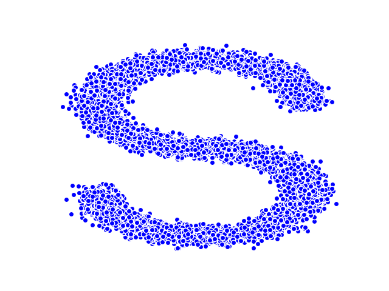

# LightDDPM

This is a light implementation of [*Denoising Diffusion Probabilistic Models*](https://arxiv.org/abs/2006.11239) 
on a toy manifold learning dataset [*s_curve*](https://scikit-learn.org/stable/auto_examples/manifold/plot_compare_methods.html#sphx-glr-auto-examples-manifold-plot-compare-methods-py)
from scikit-learn.

     
    
     

## System Requirement

This code has tested with [pytorch 1.13.1](https://pytorch.org/)

## Run

See [demo.ipynb](demo.ipynb)

